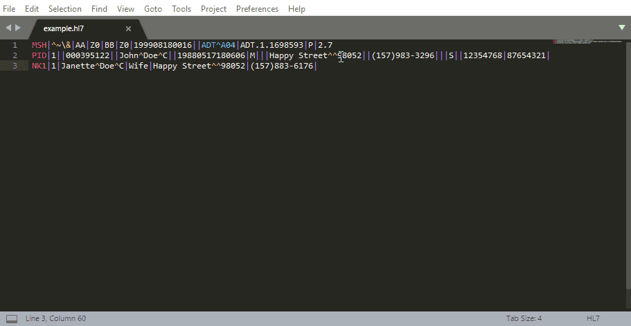
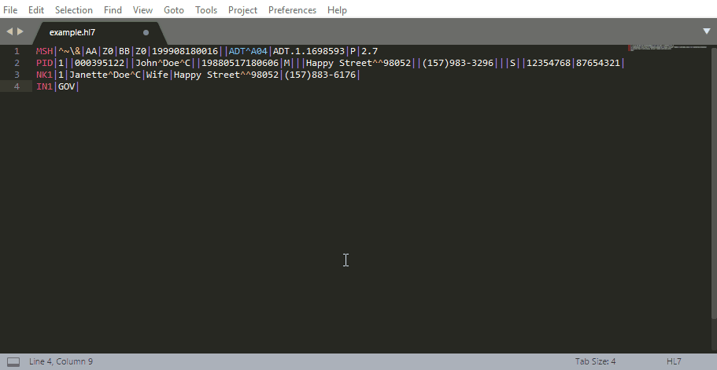
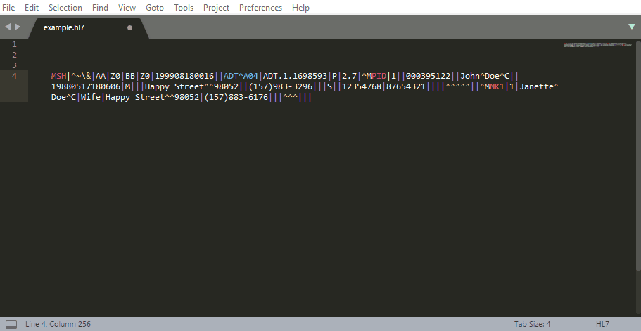
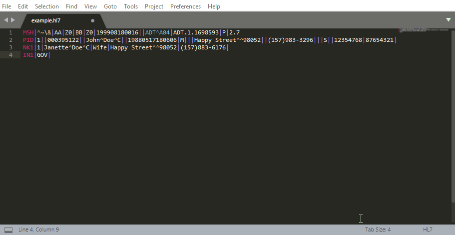
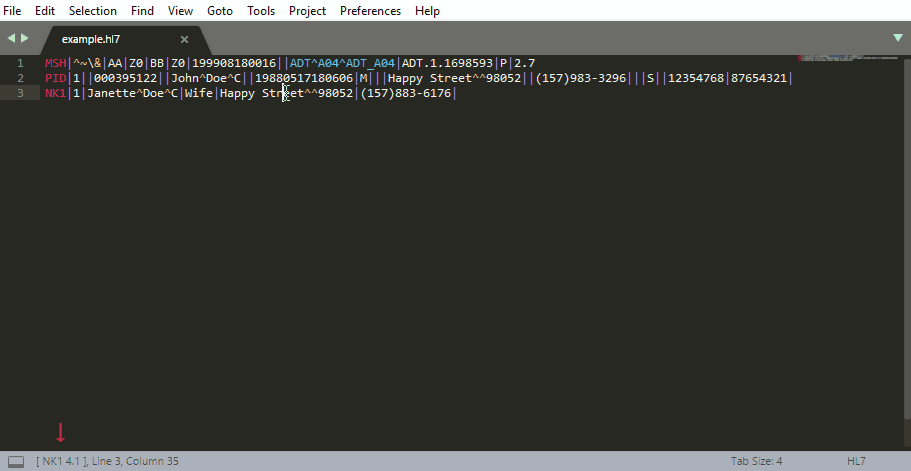

# ST3 - HL7 plug-in and syntax highlighter

HL7 Sublime Text 3 plug-in and syntax highlighter to make the life of those who work in the Health Integration field easier.

## Functionalities

### Enhanced syntax highlighter

### Segment inspector
Gives a description of the segment and parses it.

### Message Cleaner
Cleans an HL7 message from unwanted escape characters such as "^M". It also cleans every unnecessary "|" and "^" to improve readability.

### Segment / Event search
Searches on Caristix web site the given segment (e.g. PID, OBX, ...) or event (e.g. ADT^A01, ADT_A04). Notice that events separated with both ^ and _ are valid searches.
9

### Keyword Inspector
On double click shows the description of the message (e.g. ADT_A01) or the segment (e.g. PV1).

### Status Bar
Quickly know which field you are looking to.

## License

This project is licensed under the MIT License - see the [LICENSE.md](LICENSE.md) file for details

## Installation

Manual Install (windows):

* Clone / copy the whole repository to your machine
* Extract the folder to a directory similar to this one: C:\Users\\<Your.Name>\AppData\Roaming\Sublime Text 3\Packages\User\ (You can also access this directory using the Preferences >> Browse Packages...)
* Re-start Sublime Text 3

Install with Package Control:

* Package Control: Add Repository
* Use the following repository URL: https://github.com/cdgramos/Sublime-Text-3---HL7-Plug-In
* Package Control: Install Package
* Search for: Sublime Text 3 HL7 Plug-In

## Change Log
* 08-04-2018 - Initial settings and small fixes on syntax highlighter / HL7 cleaner
* 24-08-2018 - Status bar now displays the segment and position where the cursor is
* 23-07-2018 - Repetition character support
* 22-07-2018 - Keyword inspector
* 22-04-2018 - Message cleaner
* 15-04-2018 - Sub-component separator support
* 01-02-2018 - First version

## Acknowledgments

* Syntax Highlighter based on the one from @craighurley (https://github.com/craighurley/sublime-hl7-syntax)

